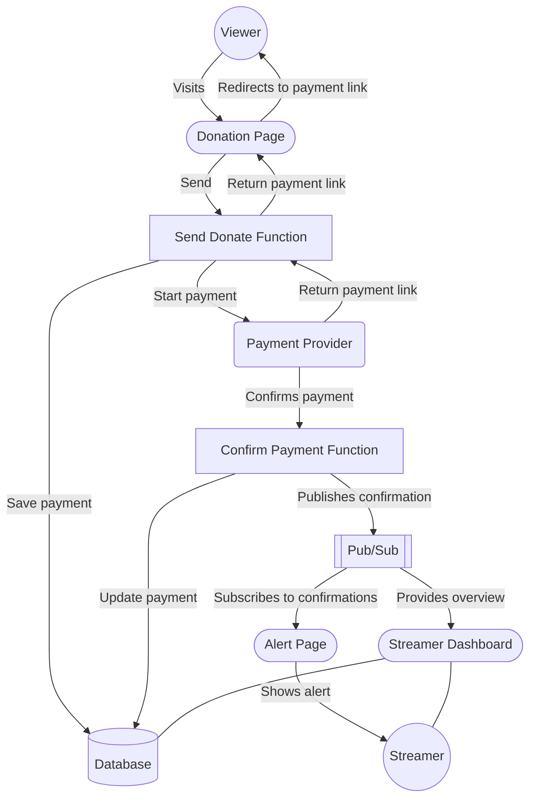

# Stredono

## Donation Flow

### Flowchart

```mermaid
flowchart TB
    V((Viewer)) --Visits--> DP([Donation Page])
    DP --Send--> SDF[Send Donate Function]
    
    SDF --Start payment--> PP(Payment Provider)
    PP --Return payment link--> SDF
    SDF --Save payment-->DB
    
    SDF --Return payment link--> DP
    DP --Redirects to payment link--> V


    PP(Payment Provider) --Confirms payment--> CPF[Confirm Payment Function]
    CPF --Update payment--> DB[(Database)]
    CPF --Publishes confirmation--> PS[[Pub/Sub]]

    PS --Subscribes to confirmations--> AP([Alert Page])
    AP --Shows alert--> S((Streamer))

    SD([Streamer Dashboard]) --- DB
    PS --Provides overview--> SD
    SD --- S
    
```

### Components

```mermaid
flowchart TB
    A((User))
    subgraph Need to be implemented
        B([Front-facing App])
        C[Cloud Function]
    end
    D(External Service)
    E[[Google Cloud Service]]
    F[(Database)]
```