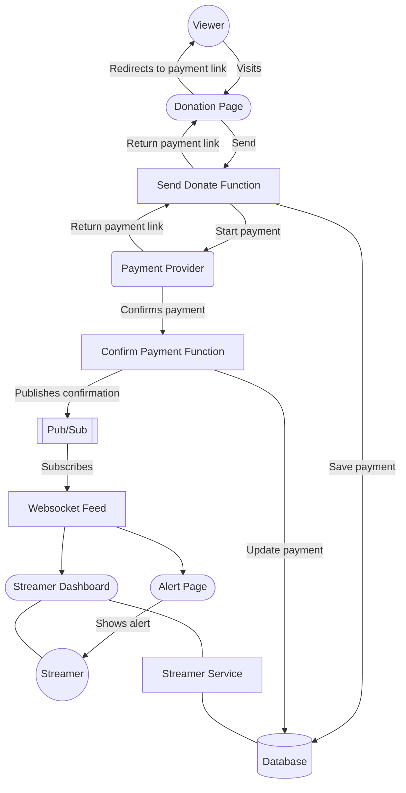
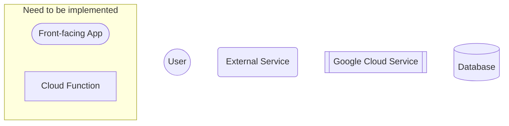

# Stredono

## Requirements

- Node.js
- pnpm
- Go
- Terraform CLI
- GCP SDK
- Python 3

## Hooks

### Setup

```bash
./scripts/setup_hooks.sh
```

### Available Hooks

- `pre-commit` - enforces `terraform fmt` and `terraform validate` before commit
- `post-checkout` switches to the correct terraform workspace based on the branch name and regenerates the output files


## Donation Flow

### Flowchart



### Components

